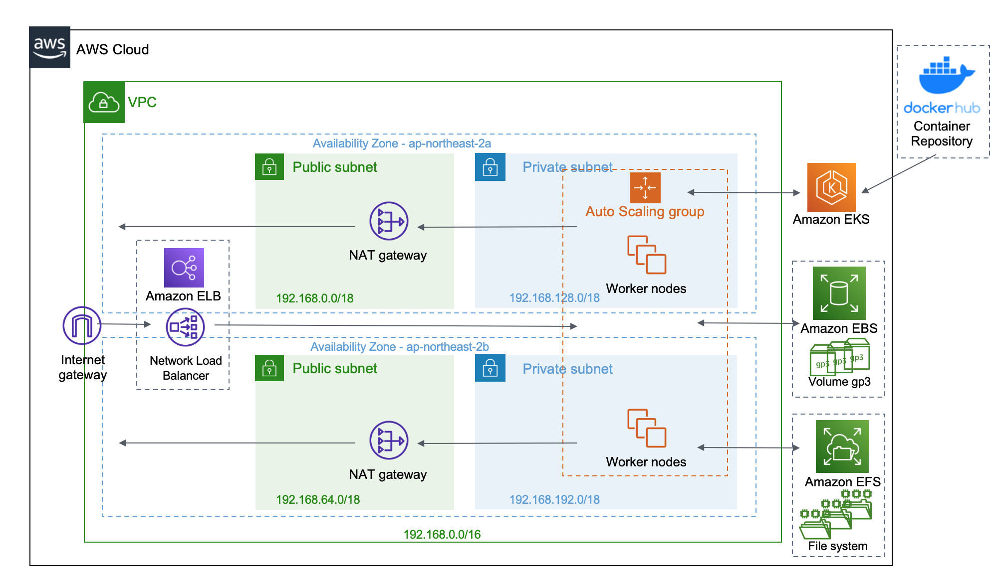

## Overview


## Create EKS Cluster

### 1. Create VPC stack using Cloud Formation stack
```
aws cloudformation create-stack \
  --stack-name <stack name> \
  --template-url https://s3.us-west-2.amazonaws.com/amazon-eks/cloudformation/2020-10-29/amazon-eks-vpc-private-subnets.yaml \
  --profile <user>
```

### 2. Create IAM Role
cluster-role-trust-policy.json 파일 참조  
<https://github.com/htdp1/md-repository/blob/main/create-eks/cluster-role-trust-policy.json>

```
aws iam create-role \
  --role-name myAmazonEKSClusterRole \
  --assume-role-policy-document file://"cluster-role-trust-policy.json" \
  --profile <username>
```

- result
```
{
    "Role": {
        "Path": "/",
        "RoleName": "myAmazonEKSClusterRole",
        "RoleId": "AROASPI4ISUMP7KRVJACR",
        "Arn": "arn:aws:iam::170247361816:role/myAmazonEKSClusterRole",
        "CreateDate": "2021-02-18T00:54:34+00:00",
        "AssumeRolePolicyDocument": {
            "Version": "2012-10-17",
            "Statement": [
                {
                    "Effect": "Allow",
                    "Principal": {
                        "Service": "eks.amazonaws.com"
                    },
                    "Action": "sts:AssumeRole"
                }
            ]
        }
    }
}
```

### 3. Attach role

```
aws iam attach-role-policy \
  --policy-arn arn:aws:iam::aws:policy/AmazonEKSClusterPolicy \
  --role-name myAmazonEKSClusterRole \
  --profile <username>
```

### 4. Create EKS cluster on Console

Console 에서 수동으로 생성  
<https://console.aws.amazon.com/eks/home#/clusters>


### 5. Create IAM OpenID Connect(OIDC) provider on Console
In the navigation panel, choose Identity Providers  
<https://console.aws.amazon.com/iam/>


### 6. Create CNI plugin IAM role
cni-role-trust-policy.json 참조하여, OpenID 설정 및 생성  
<https://github.com/htdp1/md-repository/blob/main/create-eks/cni-role-trust-policy.json>
```
aws iam create-role \
  --role-name myAmazonEKSCNIRole \
  --assume-role-policy-document file://"cni-role-trust-policy.json" \
  --profile <username>
```

- result
```
{
  "Role": {
      "Path": "/",
      "RoleName": "myAmazonEKSCNIRole",
      "RoleId": "AROASPI4ISUMAM2INZCWX",
      "Arn": "arn:aws:iam::170247361816:role/myAmazonEKSCNIRole",
      "CreateDate": "2021-02-16T08:06:50+00:00",
      "AssumeRolePolicyDocument": {
          "Version": "2012-10-17",
          "Statement": [
              {
                  "Effect": "Allow",
                  "Principal": {
                      "Federated": "arn:aws:iam::170247361816:oidc-provider/oidc.eks.ap-northeast-2.amazonaws.com/id/D042A41F174B68930A9229EE478F9CDF"
                  },
                  "Action": "sts:AssumeRoleWithWebIdentity",
                  "Condition": {
                      "StringEquals": {
                          "oidc.eks.ap-northeast-2.amazonaws.com/id/D042A41F174B68930A9229EE478F9CDF:sub": "system:serviceaccount:kube-system:aws-node"
                      }
                  }
              }
          ]
      }
  }
}
```

### 7. Create CNI policy and attach CNI role
```
aws iam attach-role-policy \
  --policy-arn arn:aws:iam::aws:policy/AmazonEKS_CNI_Policy \
  --role-name myAmazonEKSCNIRole \
  --profile <username>
```

```
aws eks update-addon \
  --cluster-name <cluster name> \
  --addon-name vpc-cni \
  --service-account-role-arn arn:aws:iam::170247361816:role/myAmazonEKSCNIRole \
  --profile <username>
```

### 8. Create Node IAM role
node-role-trust-policy.json 참조하여 생성  
<https://github.com/htdp1/md-repository/blob/main/create-eks/node-role-trust-policy.json>
```
aws iam create-role \
  --role-name myAmazonEKSNodeRole \
  --assume-role-policy-document file://"node-role-trust-policy.json" \
  --profile <username>
```

- result
```
{
    "Role": {
        "Path": "/",
        "RoleName": "myAmazonEKSNodeRole",
        "RoleId": "AROASPI4ISUMC42VNFW3V",
        "Arn": "arn:aws:iam::170247361816:role/myAmazonEKSNodeRole",
        "CreateDate": "2021-02-16T08:09:46+00:00",
        "AssumeRolePolicyDocument": {
            "Version": "2012-10-17",
            "Statement": [
                {
                    "Effect": "Allow",
                    "Principal": {
                        "Service": "ec2.amazonaws.com"
                    },
                    "Action": "sts:AssumeRole"
                }
            ]
        }
    }
}
```

### 9. Attach Node role to IAM policy
```
aws iam attach-role-policy \
  --policy-arn arn:aws:iam::aws:policy/AmazonEKSWorkerNodePolicy \
  --role-name myAmazonEKSNodeRole \
  --profile <username>
aws iam attach-role-policy \
  --policy-arn arn:aws:iam::aws:policy/AmazonEC2ContainerRegistryReadOnly \
  --role-name myAmazonEKSNodeRole \
  --profile <username>
```

### 10. Create nodegroup on console
In the Navigation Panel, Configuration > Compute  
<https://ap-northeast-2.console.aws.amazon.com/eks/home?region=ap-northeast-2#/clusters/htdp1-cluster>


## Metric Server

Amazon EKS Cluster에는 기본적으로 Metric Server가 배포되어 있지 않아서 추가 배포가 필요함  
<https://docs.aws.amazon.com/ko_kr/eks/latest/userguide/metrics-server.html>

### Metric Server Deploy
```
$ kubectl apply -f https://github.com/kubernetes-sigs/metrics-server/releases/latest/download/components.yaml

$ kubectl get deploy -n kube-system
NAME                           READY   UP-TO-DATE   AVAILABLE   AGE
aws-load-balancer-controller   1/1     1            1           10d
coredns                        2/2     2            2           10d
ebs-csi-controller             2/2     2            2           2d17h
metrics-server                 1/1     1            0           17s
```


## Kubernetes Dashboard

### Kubernetes Dashboard Deploy
- Deploy Manual
<https://docs.aws.amazon.com/ko_kr/eks/latest/userguide/dashboard-tutorial.html>
- github repository
<https://github.com/kubernetes/dashboard>

### 접속 방법

#### 1. eks-admin service account에 대한 인증 token 조회
```
kubectl -n kube-system describe secret $(kubectl -n kube-system get secret | grep eks-admin | awk '{print $1}')
```
- result
```
Name:         eks-admin-token-tbcpj
Namespace:    kube-system
Labels:       <none>
Annotations:  kubernetes.io/service-account.name: eks-admin
              kubernetes.io/service-account.uid: 9d98ae6a-9697-42a3-a1af-2a7eda64e68a

Type:  kubernetes.io/service-account-token

Data
====
ca.crt:     1025 bytes
namespace:  11 bytes
token: <authentication_token>
```

#### 2. Start Proxy
```
kubectl proxy
```

#### 3. Access the dashboard endpoint
<http://localhost:8001/api/v1/namespaces/kubernetes-dashboard/services/https:kubernetes-dashboard:/proxy/#!/login>

#### 4. Token 입력 및 Login
<authentication_token> 을 복사하여, token에 입력하여 접속

| <small>NOTE : *Dashboard 에 지표가 표시되기까지 몇 분이 걸릴 수 있습니다.*</small>
---


## Prometheus + Grafana

### Prometheus Deploy
- Helm으로 Prometheus를 EKS Cluster에 배포
<https://docs.aws.amazon.com/ko_kr/eks/latest/userguide/prometheus.html>

- Helm으로 Grafana를 EKS Cluster에 배포
<https://awskrug.github.io/eks-workshop/monitoring/deploy-grafana/>

```
$ kubectl get po -n prometheus

NAME                                             READY   STATUS    RESTARTS   AGE
prometheus-alertmanager-6b8d9d55c4-76295         2/2     Running   0          7h55m
prometheus-kube-state-metrics-6bfcd6f648-hlzn5   1/1     Running   0          7h55m
prometheus-node-exporter-fj9mh                   1/1     Running   0          7h55m
prometheus-node-exporter-nmjcv                   1/1     Running   0          7h55m
prometheus-node-exporter-w9gjz                   1/1     Running   0          7h55m
prometheus-node-exporter-zg6sq                   1/1     Running   0          73m
prometheus-pushgateway-dcc654486-czmm7           1/1     Running   0          7h55m
prometheus-server-6f5f6f4859-pc7cw               2/2     Running   0          7h55m


$ kubectl get po -n grafana

NAME                      READY   STATUS    RESTARTS   AGE
grafana-b8b886687-9zvh8   1/1     Running   0          7h29m
```

- Grafana Dashboard 구성 json 참조
  - EKS Node Monitoring
  <https://github.com/htdp1/session-k8s/blob/main/dev/monitoring/grafana/Grafana_EKS_Node_DashBoard.json>
  - EKS Pod Monitoring
  <https://github.com/htdp1/session-k8s/blob/main/dev/monitoring/grafana/EKS_Pod_DashBoard.json>

